# Basic Website

[Watch the Related Video 👇 ](https://youtu.be/Wic6ZYJU9gk)

අද අපි සරල website එකක් හදන්න තමා ලෑස්ති වෙන්නේ. මේ තියෙන්නේ ඒක.

මේකෙ බලාපොරොත්තුව HTML ලියන්න confidence එක හදන එක. HTML කියන්නෙ හරිම ලේසි දෙයක්, ඒකෙ ඇති දෙයක් නෑ ඇත්තටම. තව video එකකින් පස්සෙ මන් HTML උගන්වන්නෙත් නෑ. ඒ තරම් පොඩ්ඩයි ඇත්තටම කියලා දෙන්න තියෙන්නෙත්.

අද අපි හදන්නෙ ගොඩක් සරල website එකක්. මේකෙ title එකක්, පොඩි  description එකක් වගේම image එකක් බලාගන්න පුලුවන්. ඒ වගේම වෙනත් website එක්කට යන්න දාපු link එකක් බලාගන්නත් පුලුවන්. ඉතින් මේ දේවල් කරද්දි දැනගන්න ඕනෙ තව අමතර කාරණා කීපයකුත් අපි කතා කරනවා. ඊලඟ video එකෙන් අපි HTML ඉවර කරලා css වලට යමු.

හරි එහෙනම් ඉස්සෙල්ලම කලින් video එකේ නවත්තපු තැනට ගිහින් බලමු පොඩ්ඩක් අපේ දැනුම අලුත් කරගන්න. ඔයාට මතක ඇති මෙන්න මේ වගෙ වැඩක් තමා අපි එදා කරේ. 

```html
<html>
    <head>
        <title>Test Website</title>
    </head>
    <body>
        <h1>
            Hello World
        </h1>
        <h2>
            I am Malindu
        </h2>
        <h3>
            ඕනේ නම් සිංහලෙන් දාන්නත් පුලුවන්.
        </h3>
    </body>

</html>
```

ඉතින් මේකෙදි මන් ඔයාලට කරන්න [පොඩි වැඩකුත් දුන්නා.](./html-basics.md#homework-) ඒක කරා නම් මේ වෙද්දි ඔයාලට හොඳට අද කියන දේවල් ඔලුවට යයි. මන් කලිනුත් කීව වගේ series එක ඉස්සරහට යද්දි මන් පොඩ්ඩ පොඩ්ඩ advanced විදිහට තමා උගන්වන්නේ. ඒක තෙරෙනවා හරියට කියන විදිහට වැඩේ කරන් ගියොත්, ගැටලුවක් වෙන්නෙ නෑ. ඒක නිසා එදා කියල දුන්නා වගේ හැමදේම ගොඩාක් විස්තර කරන්න යන්නෙ නෑ. මොකද එදා කියන්න තිබ්බ මූලික දේවල් සෑහෙන්න කිවා. ඉතින් යම් කොටසක් නොතේරෙනවා නම් අනිවාරෙන් ඒ video එක ආයෙත් බලන්න, නැත්තන් කිසි ප්‍රශ්නයක් නෑ පල්ලෙහා comment එකක් විදිහට හරි [Telegram Group](https://t.me/thisismalindu_chat/1011) එකේ හරි දාන්න.

ඉතින් එහෙනම් අපි මුලින්ම file එකක් හදලා වැඩේ පටන් ගමු. ඔයා කැමති තැනකට ගිහින් කැමති නමක් දීලා `html` file එකක් හදාගන්න. මන් දැනට `basicwebsite.html` කියලා හදාගන්නම්.

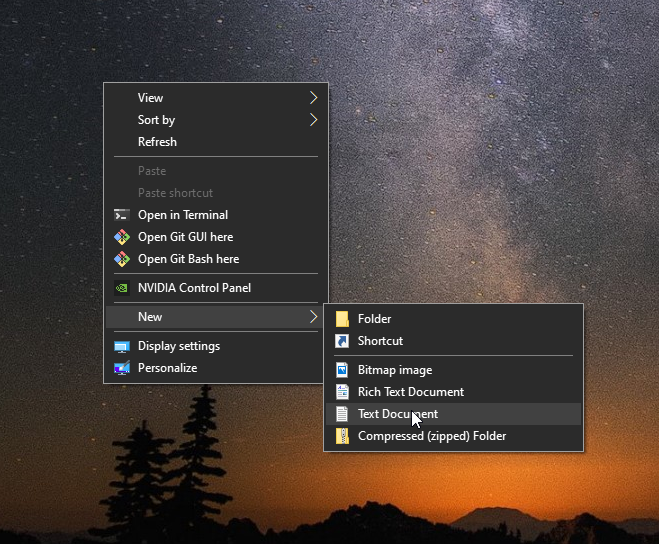

<div style="display:flex; align-items:stretch; gap:1rem;">
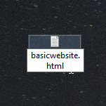
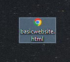
</div>

දැන් මේක right-click කරලා Open With ගිහින් Visual Studio Code තෝරන්න.

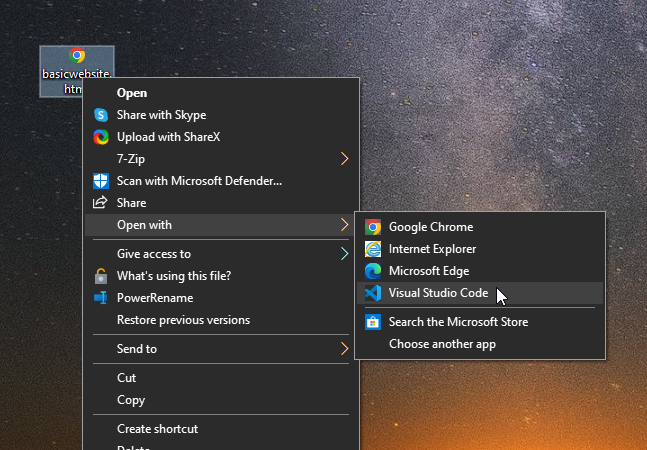

ඉතින් මේක අපි කලින් files හදාගෙන open කරපු විදිහට වඩා වෙනස් නේ. ඉතින් ඔයාට මේ ඕනම ක්‍රමයකට මේක කරන්න පුලුවන් කියන එක කියල දෙන්න තමා අද මේ විදිහට කරේ.

හරි, ඒ වගේම ආයෙත් file එක right-click කරලා Open With ගිහින් Google Chrome තෝරන්න.

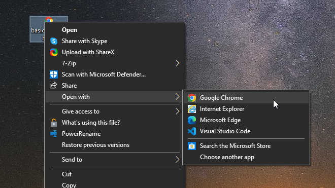

දැන් ඔයාට පුලුවන් ඕනෙ නම් මේ windows දෙක මේ විදිහට දෙපැත්තට ඇදල දාලා එක පැත්තක ලියන ගමන් අනික් පැත්තෙන් output එක බලාගන්න පුලුවන් විදිහට හදාගන්න.

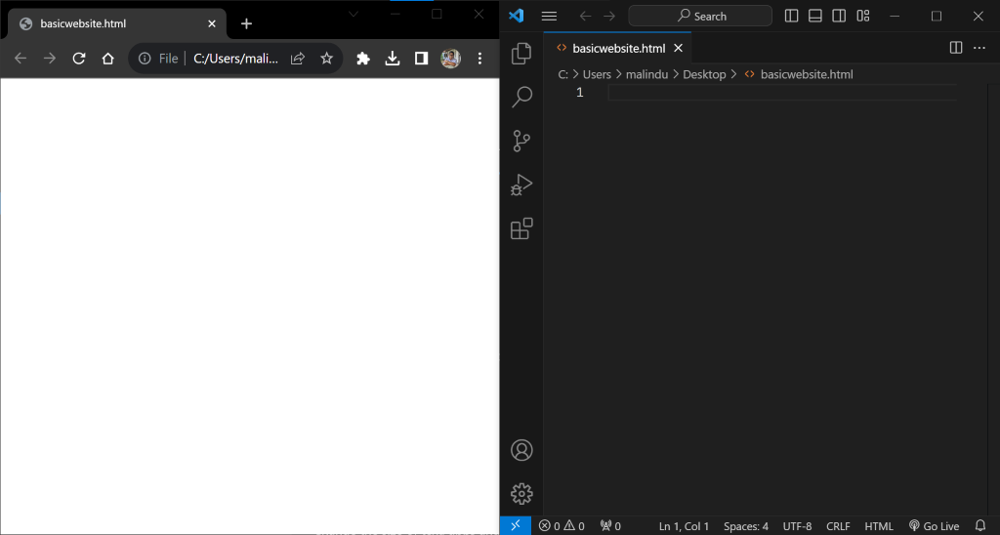

හරි දැන් එහෙනම් අපි codes ටික ලියන්න ගමු.

මුලින්ම අපි basic structure එක දාගෙන ඉමු.

```html
<html>
    <head>

    </head>
    <body>

    </body>
</html>    
```

`Title` එකක් එහෙම add කරලා `h1` එකක් දාලා මේක හරියට වැඩ කරනවද බලමු.

```html
<html>
    <head>
        <title>Basic Website</title>
    </head>
    <body>
        <h1>Welcome to my Website</h1>
    </body>
</html> 
```

දැන් මේ file එක save කරලා chrome එකට ගිහින් refresh කරලා බලන්න, මේ වගේ output එකක් එන්න ඕනේ.

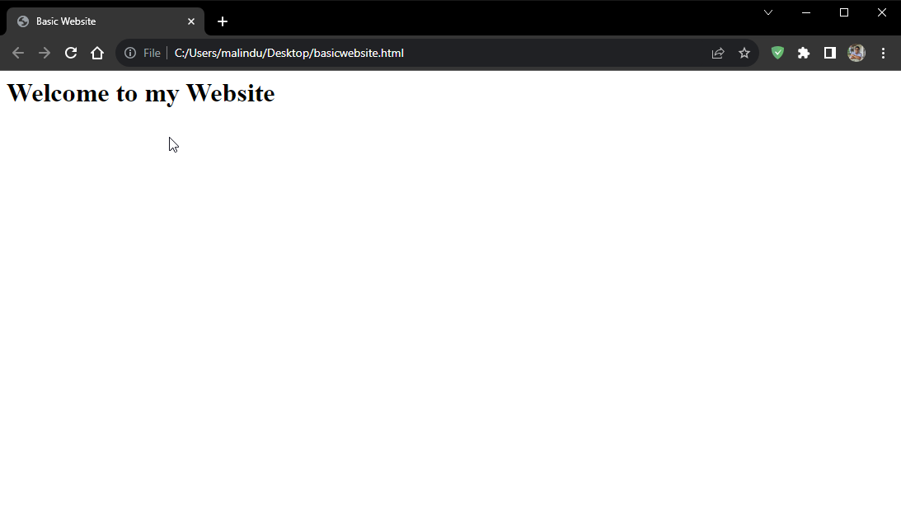

ඉතින් මුලින්ම පටන් ගද්දි දැක්කා වගේ, අපි හදන website එකේ, `title` එකක්, `description` එකක්, `image` එකක් වගේම `link` එකක් බලාගන්න පුලුවන්.
ඉතින් අපි ඉස්සෙල්ලම අපි දන්න දේවල් ටික දාමු. `Title` එකයි `description` එකයි. මන් මෙතනදි title කිවෙ heading එකක් කියන අදහසින්. HTML title එක ගැන නෙමේ කීවේ.

අපේ `h1` එකට පහලින් මෙන්න මේ විදිහට ගහන්න.

```html
<p>Hey guys, look at my website - I am officially a Web Developer now!</p>
```
ඉතින් මේ තියෙන්නෙ අලුත් `html tag` එකක්. `<p>` tag එක. මේකෙන් පුලුවන් අපිට paragraph එකක් add කරන්න website එකට. 
`<h1>` වගේම තමා, ඒක භාවිතා වෙන්නෙ headings වලට, `<p>` භාවිතා වෙන්නේ paragraph වලට. එදා tags වැඩ කරන හැටි කියල දුන්න නිසා මන් හිතනවා මීට වඩා දෙයක් කියන්න ඕනේ නෑ කියලා.

ඉතින් ඒක add කරාම මෙන්න මේ වගේ තමා final code එක පේන්න ඕනෙ.

```html
<html>
    <head>
        <title>Basic Website</title>
    </head>
    <body>
        <h1>Welcome to my Website</h1>
        <p>Hey guys, look at my website - I am officially a Web Developer now!</p>
    </body>
</html> 
```
දැන් output එක මේ වගේ වෙන්න ඕනෙ. (page එක refresh කරන්න අමතක කරන්න එපා)

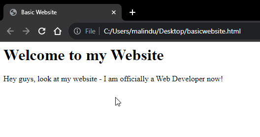

ඊලඟට තියෙන්නෙ image එකක් add කරන එක. ඒත් ඒක කරන හැටි මන් ඔයාලට කියන්නෙ නෑ. ඒ වගේ දන්නෙ නැති දෙයක් දැනගන්නේ කෝමද කියලා පෙන්නන්නයි යන්නේ.

Chrome එකේ අලුත් tab එකක් open කරලා, එකේ search box එකේ ගහන්න, "how to add image in html" කියලා.

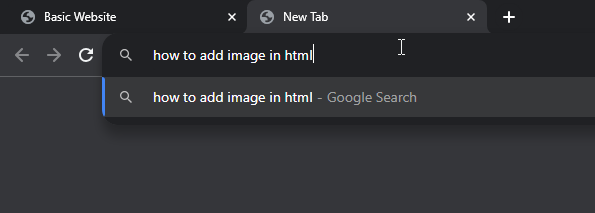

බලන්න හරිම සරලයි, අපිට ඕනේ කියල හිතුන දේ ඒ විදිහටම ලීවා. දැන් `enter` දුන්නම, ඔයාට එයි google search results කීපයක්. මේවාගේ තියෙනවා කොහොමද මේක කරන්නෙ කියන එක. අපි එක්කට ගිහින් බලමු.

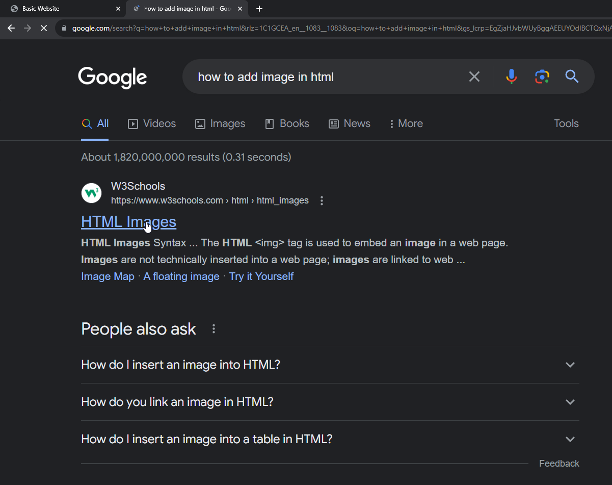

මේ උඩම තියන W3Schools link එකට ගිහින් බලමු.

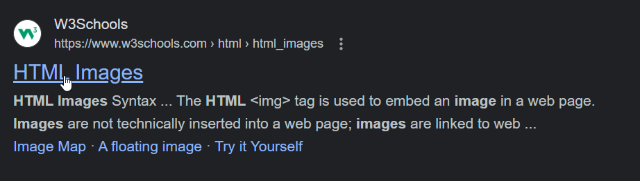

දැන් පේනවා ඇති මෙයාල පෙන්නල තියනවා කොහොමද image එකක් add කරන්නේ කියලා.

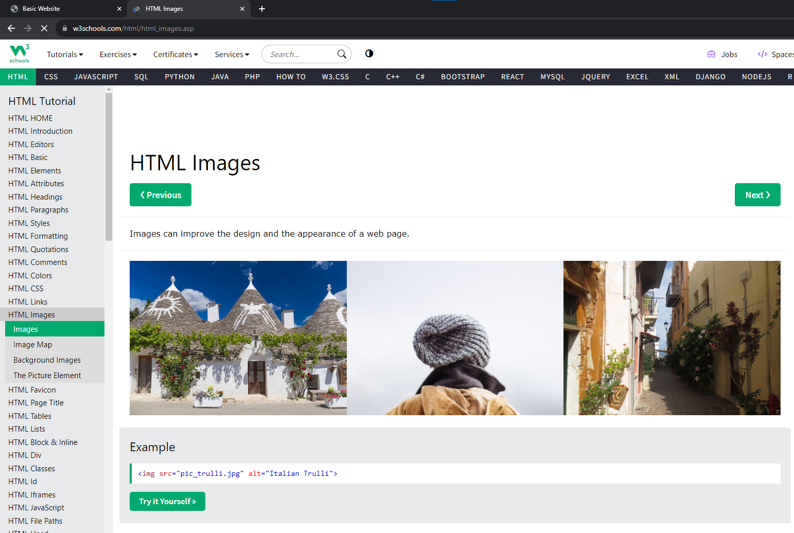

ඉතින් මේ example එක දිහා බලල අපි මේක පොඩ්ඩක් තේරුන් ගන්න බලමු.

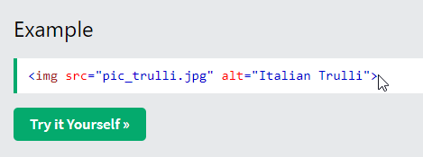

ඉතින් අපිට මුලින්ම පේන දේ තමා මේකෙදි තියෙන්නෙ `h1` වගේ `img` කියල tag එකක්. ඒ වගේම මෙකට closing tag එකකුත් නෑ. ඊට අමතරව මේකේ තව opening tag එක ඇතුලේ එක එක දේවල් ටිකක් තියනවා.

හරි, එකින් එක බලමු.

පලවෙනි නිරික්ෂණය තමා closing tag එකක් නැති වීම. එහෙම තමා, සමහර tags වලට closing tag එකක් නෑ. මේවට අපි කියන්නේ self closing tag කියලා. ඉතින් මේ img tag එක අන්න ඒ ජාතියේ එකක්. මේකට හේතුව තමා img tag එකට අවශ්‍ය දේවල් එයාගෙ `attributes` වලදි තමා අපි දෙන්නේ. මොනවද මේ attributes කියන්නේ. ඒවා තමා අර opening tag එකේ තියෙන අමතර දේවල් ටික. Attributes කියන එක නිකමට ඒ tag එකට අදාල settings වගේ කියල හිතාගන්නකෝ. img tag එක හරියට screen එකේ render කරන්න අවශ්‍ය settings කියලා හිතාගන්න. එක එක self closing tags වලට එක එක ජාතියෙ attributes තියෙනවා. සමහර self closing tags වලට attributes නැති වෙන්නත් පුලුවන්. ඒ වගේ එකක් මන් ඉස්සරහට පෙන්නන්නම්. ඉතින් ඔයා කරන්න ඕනේ දේ තමා මේ එදා කීව ජාතියෙ tag එකක් නොවුන එක ගැන බය නොවෙන එක. ඔයාට ඕනෙ නම් img tag එකත් normal tag එකක් විදිහට open කරලා close කරන්න පුලුවන්. නමුත් tags දෙක අතරේ අපි මොනවත් content දාන්නෙ නැති නිසා අපිට අමතර type කරන්න වෙන එක අඩු කරන්න තමා මේ වගේ self closing tags කියලා ජාතියක් වෙනම හදලා තියෙන්නේ.

හරි, ඊලඟට යමු මේ img tag එකේ තියෙන attributes වලට. 

```html

```
ඉතින් මේ img tag එකේ අපිට බලාගන්න පුලුවන් attributes 2ක්. පලවෙනි එක තමා `src` කියන්නේ. මේකෙ තෙරුම source කියන එක. ඒ කියන්නේ අපි display කරන්න යන  image එකේ location එක සරලවම. image එක තියෙන්නෙ කොහෙද කියන එක තමා අපි මේ කියන්නේ. අපි `src="image.jpg"` කියල ගැහුවම browser එක ඒ location/url එකෙන් image එක download කරලා අපේ website එකේ අදාල img tag එක තියෙන තැන display කරනවා.

ඊලඟට තියනවා alt කියන attribute එක. `alt="image description"` මේක ඇත්තටම image එක display කරන්න අත්‍යවශ්‍ය නෑ. මේක තියෙන්නෙ ඇත්තටම accessibility කියලා දේකට. ඊට අමතරව search engine optimization වලටත් මේක වැදගත් වෙනවා. සරලවම කීවොත් සමහර ඇස් පෙන්නෙ නැති අය එහෙම web browse කරද්දි screen readers කියලා software/tool ජාතියක් යොදාගන්නවා. මේවා සරලවම කරන්නේ screen එකේ තියෙන content අරයට ඇහෙන්න කියවන එක. එතකොට image එකක් එහෙම කියවන්න බෑ නේ. ඒක නිසා image එකේ තියෙන්නේ මොකද්ද කියලා අරයට දැනුම් දෙන්න ක්‍රමයක් විදිහට තමා මේ alt text එක භාවිතා වෙන්නේ. ඒ වගේම මේක දැම්මම search engines වලටත් ඒ image එක මොකද්ද කියලා තෙරුන් ගන්න පහසුයි. එතකොට ඔයාගේ website එකට ඒකෙන් හොඳ දෙයක් තමා වෙන්නේ. මීට අමතරව අපේ website එක බලන කෙනාගේ internet speed එක ගොඩක් අඩුයි නම් image එක වෙනුවට alt text එක display කරන අවස්තාත් තියනවා. සමහර වෙලාවට ඔයාම දැකලා ඇති website එක්කට යනකොට අතරමගදි connection අවුලක් ගියොත් images load වෙලා තිබ්බෙ නැත්තන් ඒවා වෙනුවට පොඩි image icon එකක් එක්ක text එකක් display වෙනවා. ඉතින් ඔන්න ඔය කාරණා වලට තමා මේ alt attribute එක යොදාගන්නේ.

ඉතින් ඔන්න ඔය දේවල් ටික එකතු කරගෙන අපිට පුලුවන් සාර්තකව image එකක් display කරන්න. ඒත් ඒකට අපිට image එකක් ඕනේ. ඉතින් images නම් ඕන තරම් තියෙන්නේ internet එකේ. ඔයත් google search එකක් දාලා ඔයා කැමතිම image  එකක් තෝරගෙන ඒක `right-click` කරලා `copy image address` click කරලා image එකේ url එක copy කරගන්න. ඊට පස්සෙ අර img tag එකේ src attribute එකට දාන්න. Alt text එක විදිහට ඔයාගේ තෝරගත්ත image එකට ගැලපෙන description එකක් දාන්න. මන් දාන්නම් "a picture of a cat" කියලා.

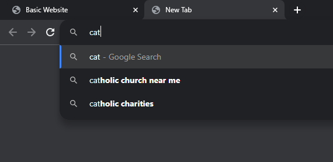

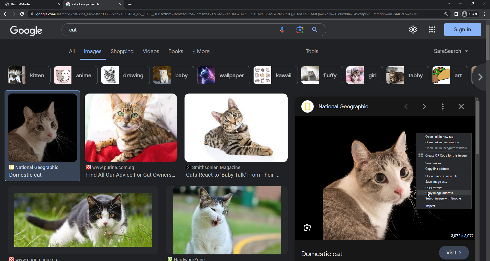

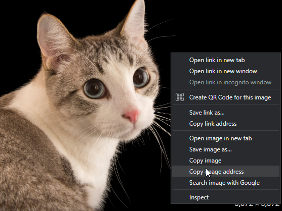

```html

```
දැන් අවසාන code එක මෙන්න මේ විදිහට තමා තියෙන්න ඔනෙ.

```html
<html>
    <head>
        <title>Basic Website</title>
    </head>
    
        <h1>Welcome to my Website</h1>
        <p>Hey guys, look at my website - I am officially a Web Developer now!</p>
        
    </body>
</html> 
```
මේ code ලියද්දි ටිකක් දිගට එක පෙලක් යනවා නම් ඔයාට පුලුවන් vscode එකේ word wrap feature එක on කරන්න. එතකොට screen එකේ එක සැරේ පෙන්වන්න පුලුවන් ටික පෙන්නල ඉතුරු ටික අලුත් line එක්කින් දානවා. මේක original code එකට කිසි වෙනසක් කරන්නෙ නෑ. අපිට code එක පෙන්වන විදිහ විතරයි වෙනස් කරන්නේ. ඒක enable කරන්න ඔයාට පුලුවන් `Ctrl+Shift+P` ඔබලා command palette එක අරගෙන ඒකෙ `word wrap` කියල type කරලා අදාල එක ආවම `enter` ඔබන්න.

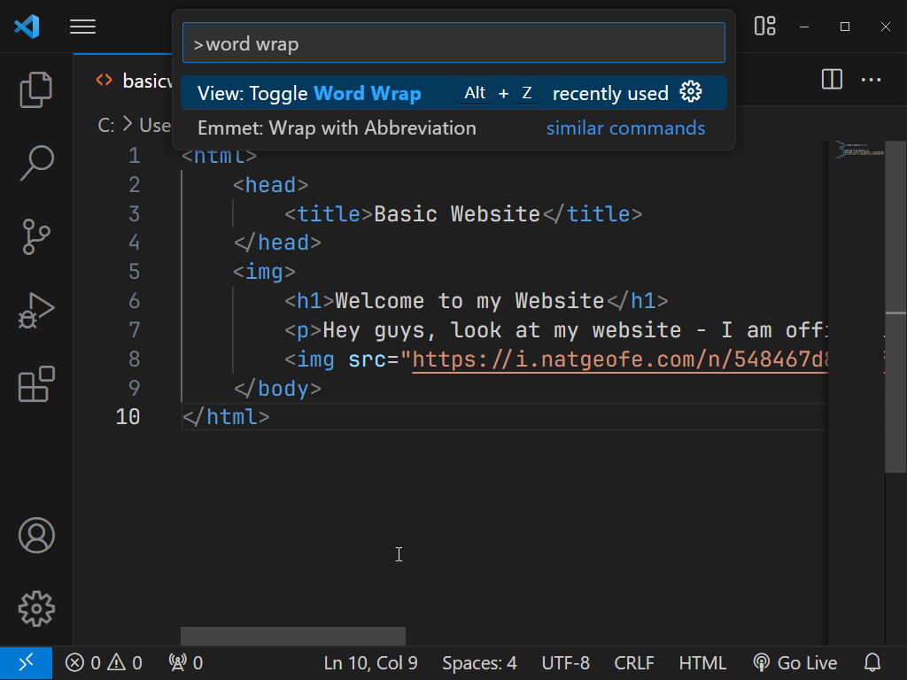

එහෙම කරාම මේ වගේ එක්කින්,


මේ වගේ එක්කට යන්න පුලුවන්. දැන් කියවන්නත් පහසුයි.

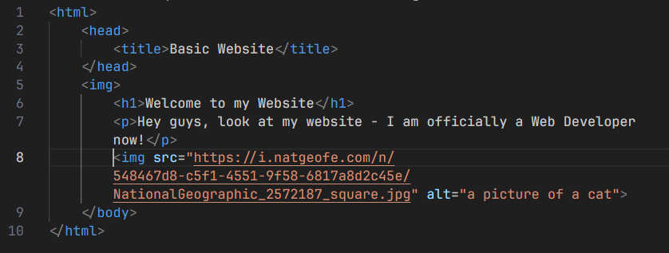

ඉතින් ඔයා තෝරගත්ත image එක මගෙ වගේ ගොඩක් ලොකු එකක් නම් මෙන්න මේ වගෙ ලොකූ වෙලා පෙන්නයි. ඒක හරි ගස්සන්නත් පුලුවන් අපිට.

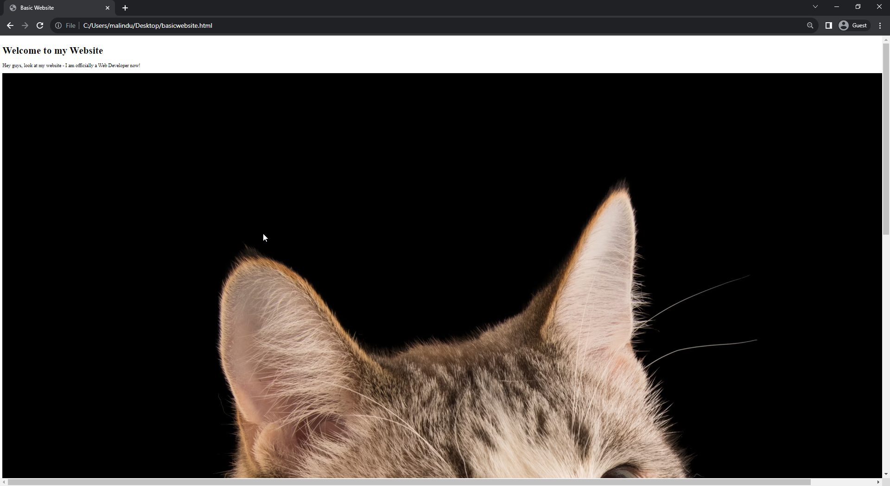

අපි කලින් කතා කරපු src, alt වගේ තව attributes තියනවා. මේ වෙලාවේ අපි භාවිතා කරමු `height` කියන attribute එක. ඕනෙ නම් `width` කියන එක use කරන්නත් පුලුවන්. මේ attributes වලින් අපිට පුලුවන් වෙනවා අපේ image එකට අපි කැමති height එකක් width එකක් දෙන්න. එහෙම නොදුන්නොත් browser එක image එකේ original size එක තමා භාවිතා කරන්නේ. ඉතින් අපි අර alt එකට පස්සෙ `height="500"` විදිහට type කරගමු.

මේකෙන් අපි  browser එකට කියනවා අපේ image එකේ height එක නැත්තන් උස `500px` කරන්න කියලා. එතකොට browser එක අපේ screen එකේ pixels 500ක් උසට අර  image එක display කරනවා. අපි width එක කියපු නැති නිසා browser එක හරිම smart විදිහට, අපේ height එකට ගැලපෙන්න image එක විකුර්ති නොවෙන විදිහට original image එකේ අනුපාතයට ගැලපෙන්න width එක adjust කරලා දෙනවා. ඒක නිසා අපි ඒක හිතලා කරන්න ඔනෙ නෑ. height හරි width හරි දෙකෙන් එකක් දුන්නනම ඇති.

දැන් අපේ image tag එක මෙන්න මේ වගේ තියෙන්න ඕනේ.

```html

```
සම්පූර්ණ code එක ඔන්න තියනවා.

```html
<html>
    <head>
        <title>Basic Website</title>
    </head>
    
        <h1>Welcome to my Website</h1>
        <p>Hey guys, look at my website - I am officially a Web Developer now!</p>
        
    </body>
</html> 
```
දැන් අපේ image එක ලස්සනට හරි ගානට display වෙලා තියෙන්න ඕනේ.

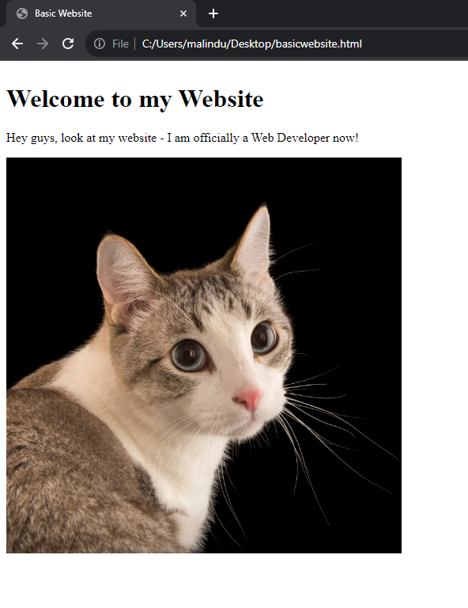

හරි දැන් අපේ website එකේ image එකක් display කරන්නත් දන්නවා. තව දෙයක්, මේ height attribute එක ගැනත් ඔයාට අමතක උනොත් ඔයාට පුලුවන් ඒකත් google කරලා හොයාගන්න. ගොඩක් දුරට ඔයාට එයි CSS වලින් මේක කරන හැටි මොකද ඇත්තටම මන් මුලම videos වල කීවා වගේ HTML තියෙන්නෙ අපේ website එකේ structure එක define කරන්න විතරයි. ඒකේ තියෙන දේවල් display වෙන්න ඕනේ කෝමද කියන එක කරන්න ඕනෙ CSS වලින්. නමුත් අපි දැනට CSS ඉගෙන ගන්නකන් තමා මේ විදිහට height එක හරි ගැස්සුවේ.

තව දෙයක් තියනවා. අපි මෙතනදි භාවිතා කරේ වෙනත් කෙනෙක්ගෙ website එක්ක තියන image එකක් නේ. අපිට ඕනෙ නම් අපේ computer එකේ තියෙන image එකක් උනත් මෙතනට දාන්න පුලුවන්. ඒකට ඒ image එකට අදාල path එක copy කරලා මෙතන paste කරන්න. ලේසිම වැඩේ තමා ඒ ඔයාට දාන්න ඕනෙ image එක මේ html file එක තියෙන තැනටම copy කරගන්න එක. ඊට පස්සෙ ඔයාට ඒක ලේසියෙන්ම දාගන්න පුලුවන්. මන් ක්‍රම දෙකම පෙනවන්නම්.

Computer එකෙ කොහෙ හරි තියෙන එකක් දාගන්න ඕනේ නම් මෙන්න මෙහෙම කරන්න.

ඉස්සෙල්ලම ඒ image එක තියෙන තැනට ගිහින් එක උඩ click කරන්න.

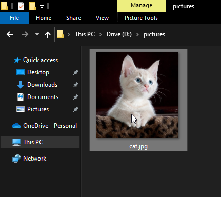

දැන් shift key එක ඔබාගෙන right-click කරන්න. එතනින් එන menu එකෙන් Copy as Path ඔබන්න.

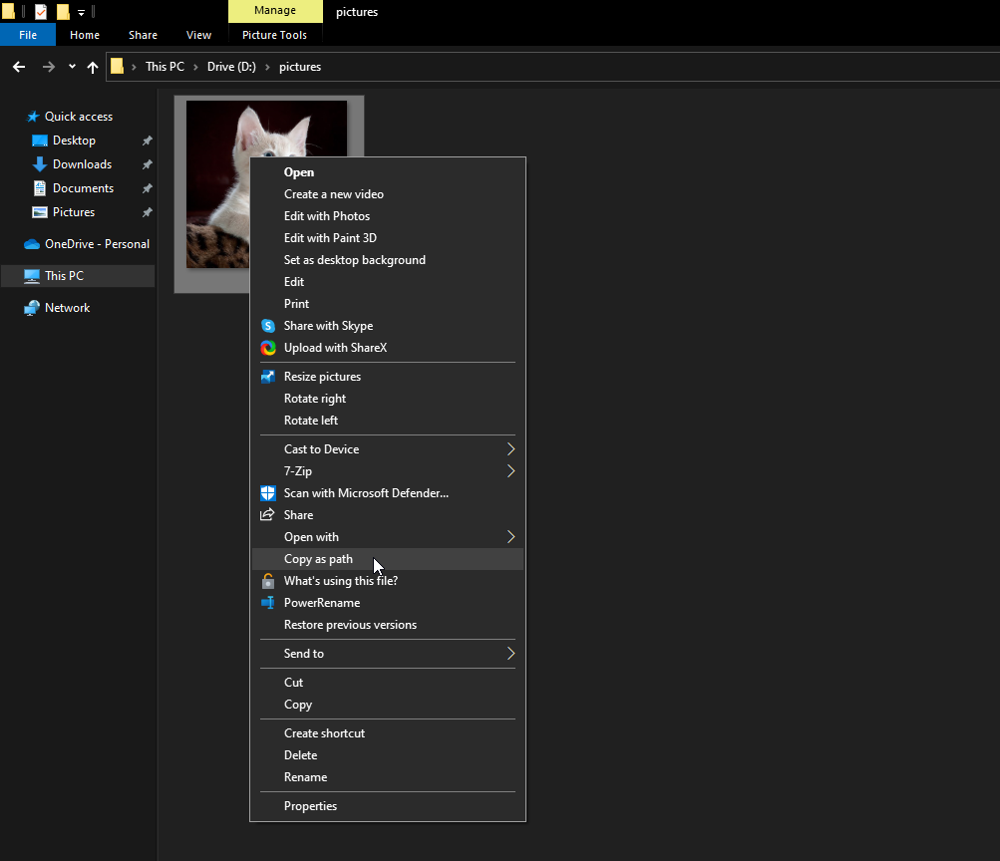

දැන් අර ඔයාගෙ HTML code එකේ img tag එකේ src attribute එකට ගිහින් paste කරන්න (Ctrl+V).
මගෙ code එක තියෙන්නෙ මෙහෙම මොකද මගෙ image එක තියෙන්නෙ මගෙ  D drive එකේ pictures කියලා folder එක්ක.
```html

```
දැන් full code එක මෙහෙම තියෙන්න ඕනේ.

```html
<html>
    <head>
        <title>Basic Website</title>
    </head>
    
        <h1>Welcome to my Website</h1>
        <p>Hey guys, look at my website - I am officially a Web Developer now!</p>
        
    </body>
</html> 
```
ඔයාට පේනව ඇති දැන් හරියටම image එක වෙනස් වෙලා තියනවා මන් දාපු අලුත් image එකට.

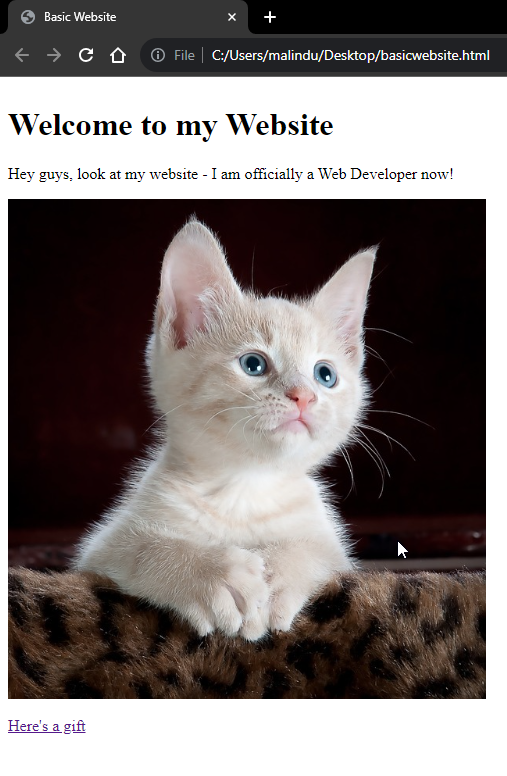

දැන් බලමු කෝමද html file එක තියෙන තැනටම දාපු image එකක් මෙතනට දාගන්නෙ කියලා.

මුලින්ම අදාල image එක html file එක තියෙන තැනට copy කරගන්න.

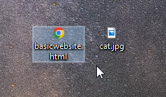

දැන් img tag එකේ src attribute එකට මෙහෙම දාන්න.

```html

```
ඔව් නිකන්ම image file එකේ නම. මගේ image file එකේ නම `cat.jpg`, ඉතින් ඒක මේ විදිහට දාන්න ඕනේ. මෙහෙම දැම්මම browser එක දන්නව මේක තියෙන්නෙ අපි දැන් බලන් ඉන්න html file එක තියෙන folder එකේමයි කියලා.

දැන් full code එක මෙහෙම තියෙන්න ඕනේ.

```html
<html>
    <head>
        <title>Basic Website</title>
    </head>
    
        <h1>Welcome to my Website</h1>
        <p>Hey guys, look at my website - I am officially a Web Developer now!</p>
        
    </body>
</html> 
```


ඔන්න ඔහොම ඔයාට ඔයා ගාව තියෙන image එකක් උනත් දාගන්න පුලුවන්. වෙනත් website එක්ක තියෙන එකක් වෙන්නම ඕනෙ නෑ.

Programming වල තියන හොඳම දෙයක් තමා ඔයා මොකුත් මතක තියාගන්න ලොකු මහන්සියක් දරන්න ඕනේ නෑ. ඔයාට හැමදේම google කරලා හොයාගන්න පුලුවන්, හැමෝම කරන්නෙත් එහෙම තමයි. පුරුද්දත් එක්ක සමහර දේවල් නිකන්ම මතක හිටිනවා. ඒක හොඳ දෙයක්, නමුත් අමතක උනාට ගැටලුවක් නෑ. ඔයාට ඒක හොයාගන්න පුලුවන්. Computer එක්කින් නේ programming කරන්නේ, ඉතින් ඒක නිසා ඒකෙන් internet එකට ගිහින් අවශ්‍ය දේ හොයාගන්නත් පුලුවන්. Programmer කෙනෙක්ට වැදගත්ම දේ තමා logical thinking දියුණු කරගන්න එක. මොකද ඔයාට එතකොට මොකක් හරි ප්‍රශ්නයකට පිලිතුර හිතල ඒක code එකට පරිවර්තනය කරන හැටි ඕනෙ තැනකින් බලාගෙන කරන්න පුලුවන්. ඔක්කොම codes ටික දැනගන්න එක නෙමේ programmer කෙනෙක් වෙනවා කියන්නේ. මේක හරියටම නිකන් open book exam එකක් වගේ දෙයක්.

හරි ඊලඟට අපි යමු ඊලඟ element එකට.

දැන් තියෙන්නෙ අවසාන වැඩේ. අපේ website එකෙන් වෙනත් website එක්කට යන්න link එකක් දාන එක. මේක ගොඩක් වැදගත් දෙයක්. Internet එක හැදෙන්නෙ මෙහෙම. මොකද ගොඩක් වෙලාවට අපි කරන්නෙ එක website එක්කින් තවත් එක්කට යන එක. මේවට උදව් වෙන්නේ අපි ඊලඟට use කරන්න යන tag එක.

ඒ තමයී `anchor` tag එක. මේකෙන් පුලුවන් අපිට මොකක් හරි දෙයක් එබුවම වෙනත් website එක්කට හරි page එක්කට හරි නැත්තන් download එකක් හරි නැත්තන් මොකක් හරි image එකක් open වෙන විදිහට හදන්න. අපි YouTube video එක්කට යන විදිහට anchor tag එකක් දාන හැටි බලමු. 

```html
<a href="https://www.youtube.com/watch?v=dQw4w9WgXcQ">Here's a gift</a>
```
ඉතින් මෙන්න මේක ඔයාගෙ img tag එකට පස්සෙ type කරගන්න. එතකොට full code එක මෙන්න මේ වගේ තමා තියෙන්න ඕනේ.

```html
<html>
    <head>
        <title>Basic Website</title>
    </head>
    
        <h1>Welcome to my Website</h1>
        <p>Hey guys, look at my website - I am officially a Web Developer now!</p>
        
        <a href="https://www.youtube.com/watch?v=dQw4w9WgXcQ">Here's a gift</a>
    </body>
</html> 
```
දැන් බලමු මොකද්ද මේ ලීවේ කියලා.

මුලින්ම තියනවා සුපුරුදු පරිදි අපේ opening tag එක. ඔව් මේ anchor tag එක normal tag එකක්. self closing නෙමේ. මොකද මේකේ අපිට click කරන්න ඕනේ මොකද්ද කියන එක දාන්න තැනක් තියනවා. 
ඒ වගේම anchor tag එක ලියද්දී අපි 'a' අකුර විතරයි ලියන්නේ. මේක කරලා තියෙන්නෙ type කරන එක පහසු කරන්න. ඉතින් මේ tag එකෙත් attributes තියනවා. මෙතනදි අපි භාවිතා කරලා තියෙන්නෙ `href` කියන attribute එක. ඒකෙ තේරුම hypertext reference කියන එක. මේකට තමා අපි යන්න ඕනෙ link එක දාන්නෙ. මේක website url එකක් වෙන්න පුලුවන්, අපේම website එකේ තවත් page එකක් වෙන්න පුලුවන්. නැත්තන් මොකක් හරි file එකක් download කරන්න දෙන්න නම් ඒ file එකේ url එක වෙන්න පුලුවන්. Image url එකක් උනොත් ඒ image එක load වෙනවා. ඉතින් මන් මෙතනට නිකන් YouTube video එක්ක link එකක් දැම්මා. ඔයාට කැමති දේකට link එකක් මෙතනට දාන්න පුලුවන්. ඕනේ නම් ඔයාගෙ facebook නැත්තන්  instagram account එකට යන්න link එක දාන්න. කැමති දෙයක්.

හරි ඊලඟට තියනවා අපි අර කියපු link එකට යන්න නම් ඔබන්න ඕනෙ දේ. ("Here's a gift" කියන එක)

```html
<a href="https://www.youtube.com/watch?v=dQw4w9WgXcQ">Here's a gift</a>
```
මෙතනට ඔයාට කැමති දෙයක් දාන්න පුලුවන්. ඒ කියන්නෙ ඕනෙ නම් මන් දාල තියනවා වගෙ සාමන්‍ය text එකක් දාන්න පුලුවන්. නැත්තන් තවත් html element එකක් දාන්න පුලුවන්. ඒ කියන්නෙ ඔයාට ඕනෙ නම් පුලුවන් h1 tag එකක් උනත් මෙතනට දාන්න. එතකොට a tag එකේ content එක විදිහට අන්න ඒ h1 tag එක තමා display වෙන්නේ. ඒ කියන්නේ ඔයාට ඕනේ නම් මෙතනට image එකක් උනත් දාන්න පුලුවන්. මන් කලින් දවසකත් කීවා වගේ html ලියද්දි අපි මේ nesting behaviour එක use කරනවා. ඉතින් අපි html tag එක ඇතුලේ body tag එක දාල ඒක ඇතුලේ මේ අනික් tags දැම්මා වගේ අපිට පුලුවන් a tag එක ඇතුලෙත් තවත් tag එකක් දාන්න. ඔයාට ඕනේ නම් ඔයා කලින් දාපු image element එක cut කරල මෙතනට දාන්න. එතකොට ඒ image එක click කරාම අර දාපු link එකට යවන්න පුලුවන්. මන් ඒක පෙන්වන්නේ නෑ. ඔයා ඒක තනියම කරලා බලන්න. හරියට කරොත් අනිවාරෙන් ඔයාට අමුතුම සතුටක් එයි. මේක කොච්චර powerful ද ඒ වගේම ආස හිතෙන දෙයක්ද කියන එක එතකොට තේරෙයි.

ඉතින් ඊට පස්සෙ සුපුරුදු පරිදි අපේ closing tag එක තීයෙනවා. ඔන්න ආයෙත් මන් full code එක බලාගන්න දැම්ම මෙතනට.

```html
<html>
    <head>
        <title>Basic Website</title>
    </head>
    
        <h1>Welcome to my Website</h1>
        <p>Hey guys, look at my website - I am officially a Web Developer now!</p>
        
        <a href="https://www.youtube.com/watch?v=dQw4w9WgXcQ">Here's a gift</a>
    </body>
</html>
```
දැන් ඔයා browser එක refresh කරලා බැලුවම මේ වගේ බලාගන්න පුලුවන් වෙන්න ඕනේ.

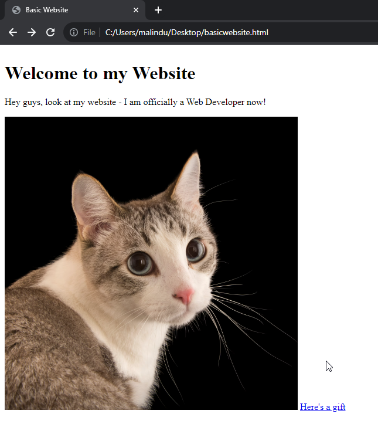

ඉතින් මේකෙ පොඩී අවුලක් තියනවා. අපේ `link` එක අලුත් පෙලකට ගිහින් නෑ. Image එක එහා පැත්තට වැටිලා. මේකට හේතුව img element එක `inline` කියලා element type එකක්. ඒ කියන්නෙ ඔය වෙලා තියන දේ තමා එකෙ default behaviour එක. `h1`, `p` වගේ ඒවා `block` type elements. ඒවාගෙදි අලුත් පෙලක තමා ඊලඟ දේ display වෙන්නේ. මේ ගැන අපි ඉස්සරහට තව කතා කරමු. දැනට මන් මේක හරි ගස්සන්න ලේසි විදිහක් පෙන්වන්නම්.

ඒකට අපිට පුලුවන් img tag එකට පස්සෙ මොකක් හරි හිස් block type element එකක් දාන්න. ඒ කියන්නේ ඔයා මොකුත් content එකක් නොදාපු `h1` හරි `p` tag එකක් හරි දැම්මොත් මේක හරි යන්න ඕනේ. ඉතින් මේ වගේ දේකදි අපිට code එක කියවන කෙනාට පොඩ්ඩක් තේරෙනවා මදි නේ මොකද්ද මේ කරල තියෙන්නේ කියලා. මොකද මේ හිස් `h1` tag එකක් දාලා තියෙන්නෙ කියලා හිතයි බලන කෙනා. ඒක නිසා ඔයාට පුලුවන් ඒ වගේ දේකටම හදපු දෙයක් use කරන්න. ඒ තමා `<br>` tag එක. මේක තියෙන්නේ line break එකක් දාන්න. මේක සාමන්‍ය‍යෙන් භාවිතා කරන්නෙ paragraph වෙන් කරන්න එහෙම තමා. නමුත් මෙතනදි යොදාගන්නත් පුලුවන්, බලන කෙනාටත් පැහැදිලි මොකද්ද මේ කරලා තියෙන්නෙ කියලා. හැබැයි හොඳට මතක තියාගන්න මේක නෙමේ මේ වැඩේ කරන්න තියන හරිම විදිහ. මන් කලිනුත් කීවා වගේ අපිට මෙතනදි ඕනේ ඇත්තටම browser එකට කියන්න කෝමද අපේ img එකයි ඊට පස්සෙ තියෙන දේවලුයි display කරන්න ඕනේ කියන එක නේ. ඒක CSS වලට භාර වැඩක්. HTML එක අස්සෙ styling ගාව ගන්න එක හොඳ දෙයක් නෙමේ. එතකොට අපිට code එක maintain කරන්න අපහසු වෙනවා. ඒක නිසා අපි මේ වගේ දේවල් professionally කරනවා අඩුයි. ඒක නිසා අපි දැනට විතරක් පොඩි trick එකක් විදිහට මේක use කරමු.

Line break එක දාන්න නිකන්ම `<br>` කියල img tag එකට පස්සෙ type කරන්න.

දැන් full code එක මේ වගේ තියෙන්න ඕනේ.

```html
<html>
    <head>
        <title>Basic Website</title>
    </head>
    
        <h1>Welcome to my Website</h1>
        <p>Hey guys, look at my website - I am officially a Web Developer now!</p>
        
        <br>
        <a href="https://www.youtube.com/watch?v=dQw4w9WgXcQ">Here's a gift</a>
    </body>
</html> 
```
දැන් browser එක refresh කරාම මේ වගේ හරියට link එක ඊලඟ පෙලට ගිහින් තියෙන්න ඕනේ.


ඔයාට ඕනේ නම් පුලුවන් තව br එකක් දාල මේ img එකයි link එකයි අතරට හිස් පේලියකුත් දාගන්න. එතකොට ටිකක් බලද්දි පැහැදිලි. ඒ උනාට මේ වගෙ දේවල් අපි ඇත්ත website හදද්දී කරන්නෙ නෑ හරිද. ආයෙත් කියනවා මේ වගේ දේවල් වලට තමා CSS තියෙන්නේ.

```html
<html>
    <head>
        <title>Basic Website</title>
    </head>
    
        <h1>Welcome to my Website</h1>
        <p>Hey guys, look at my website - I am officially a Web Developer now!</p>
        
        <br>
        <br>
        <a href="https://www.youtube.com/watch?v=dQw4w9WgXcQ">Here's a gift</a>
    </body>
</html> 
```

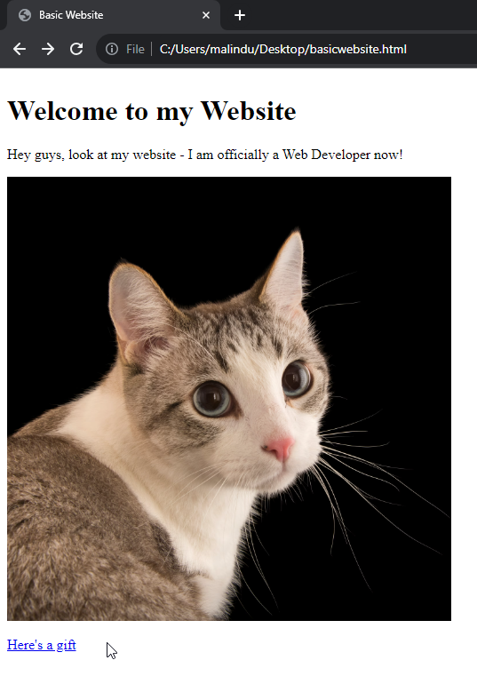

ඉතින් ඔන්න ඔයාගෙ website එක complete. මේක අනිවාරෙන් ඔයාගෙ යාලුවන්ට පෙන්වන්න. ගෙදර අයට එහෙමත් පෙන්වන්න. මරු වැඩක් තමා අද කරේ. මන් හිතනව අද ඉගෙන ගත්ත දේවල් වලින් සෑහෙන්න දෙයක් ඔයාට කරන්න පුලුවන් වෙයි කියලා. මොකද දැන් ඔයා දන්නවා කෝමද දන්නෙ නැති දෙයක් ඉගෙන ගන්නේ කියන එක පවා. ඉතින් එතකොට ඔයාට සෑහෙන්න දෙයක් කරගන්න පුලුවන්. තව පොඩ්ඩක් එක එක දේවල් හොයලා කරලා බලන්න. ඒක තමා අද ඔයා කරන්න ඕනේ වැදගත්ම දේ. ආසාවෙන් දේවල් හොය හොය කරන එක.

මෙන්න පොඩි දෙයක් නොදන්න අයට: මේක ඔයාට යාලුවන්ට try කරන්න දෙන්න නම් එක්කො ඔයාගෙ computer එක දෙන්න වෙනවා මොකද මේක අපි internet එකට මුදා හැරලා නෑ තාම. මේ website එක තියෙන්නෙ ඔයාගෙ computer එකේ. ඔයාට පුලුවන් ඔයාගෙ html file එක යාලුවට යවන්න. WhatsApp වලින් හරි email එකක් විදිහට හරි කෝම හරි යවන්න. එයාට ඒක download කරලා, එයාගෙ browser එකෙන් open කරන්න කියන්න. එතකොට එයාට පුලුවන් ඔයාගෙ මේ website එක බලාගන්න.

ඉතින් අද අපි හදපු website එකේ working demo එකක් මන් internet එකට දාල තියෙනවා. ඔයාට පුලුවන් [මෙන්න මේ link එක](https://thisismalindu.com/basicwebsite.html) click කරලා ඒකට ගිහින් බලන්න. ඒ වගේම මන් දීල තියන gift එක open කරන්නත් අමතක කරන්න එපා. 

අද අපි සෑහෙන්න දේවල් කතා කරා. නමුත් ඒ හැමදේම ලස්සනට එකිනෙකට ගැලපෙන විදිහට තමා කතා කරේ. හැමදේම practical ලෝකේ භාවිතා වෙන විදිහට තමා ඉගෙන ගත්තේ. ඒ විදිහට තමා programming ඉගෙන ගන්න ඕනේ. ඉතින් අද කතා කරපු දේවල් දරාගන්න පුලුවන් කියල හිතනවා. කලින් videos උත් බලලා දිගටම එකතු වෙලා හිටිය කෙනෙක් නම් අනිවාරෙන් තේරෙන්න ඕනෙ. ඒත් මොනවහරි අපැහැදිලි තැනක් තිබ්බොත් කිසි දේකට සැලෙන්න එපා. බය වෙන්න එපා අනිවාරෙන් comments වල හරි [Telegram Group](https://t.me/thisismalindu_chat/1011) එකේ හරි දාන්න. අනිවාරෙන් ඔයාගෙ ගැටලුව විසඳලා දෙනවා. එක එක්කෙනාගෙ ධාරිතාව වෙනස්. ඉතින් ඒක නිසා ඔයාට මොකක් හරි සැකයක් තිබ්බොත් අනිවාරෙන් කියන්න ඒක විසඳලා දෙන්න කට්ටිය ඉන්නවා.

## Homework 👨‍🏫

මෙන්න මේක තමා ඔයාට අද කරන්න තියෙන්නෙ. [එදා homework කරන හැටි කියලා දුන්න නිසා](html-basics.md#homework-) මන් කරන්න ඕනේ දේ විතරක් කියන්නම්.

ඔයාට කරන්න තියෙන්නෙ හරිම ලස්සන වැඩක්. මේක අපහසුයි කියල හිතෙයි, නමුත් හරිම ලේසි අද කතා කරපු දේවල් විතරයි මෙතන තියෙන්නේ. ඒක නිසා බය වෙන්න එපා.

ඔයා හදන්න ඕනේ image gallery එකක්. ඔයා කැමති මාතෘකාවක් යටතේ images 9ක් විතර තෝරගෙන ඒව  3x3 grid එකක් වගේ display වෙන්න ඕනේ. මේක කරන්න හරිම ලේසි. කිසිම CSS කෑල්ලක් use කරන්න එපා මොකද මන් තාම එවා කියල දීලත් නෑ, ඔයා ඒවා use කරා කියන්නෙ බොහෝදුරට ඔයා මේක google search කරලා ආපු solution එකක් copy කරා කියන එක. ඉතින් එහෙම කරන්න එපා. මේ වැඩේට ඕන හැමදේම ඔයා දැනට දන්නවා. පොඩ්ඩක් හිතලා බලල කරන්න හරිම සරල වැඩක් මේක.

ඒ කරලා ඒ image හැම එකක්ම click කරාම ඒ අදාල image එක load වෙන්නත් ඕනේ.

Page එකට heading එක්කුත් දාන්න Image Gallery වගේ. 

Final output එකේ screenshots පල්ලෙහා තියනවා. ඒ වගේම working demo එකකුත් තියනවා [මෙන්න මෙතන](https://thisismalindu.com/imagegallery.html). හැබැයි මේකෙ source code එක බලන්න එපා. තනියෙම කරන්න බලන්න. Try එකක් දීල බලන්නකෝ. තෙරුනේ නැත්තන් අනිවාරෙන් අහන්න, step by step වැඩේ සාර්ථක කරගන්න.

Images distort උනාට කමක් නෑ - ලස්සනට images grid එක්කට ගන්න නම් fixed height & width use කරන්න වෙනවා. එතකොට image එක පොඩ්ඩක් ඇදිලා ගිහින් වගේ වෙයි. ඒකට කමක් නෑ. මේ වෙලාවේ මට ඕනෙ logic එක හරියට implement කරාද බලන්න. ඔයාට හරියටම කරන්න ඕනෙ නම්, images ටිකක් download කරන් එකම අනුපාතයකට එන විදිහට crop කරල ගන්න. එතකොට height එක විතරක් set කරල ඔයාට පුලුවන් වැඩේ කරන්න.

Page එක load උනාම පේන්න ඕනෙ එක.

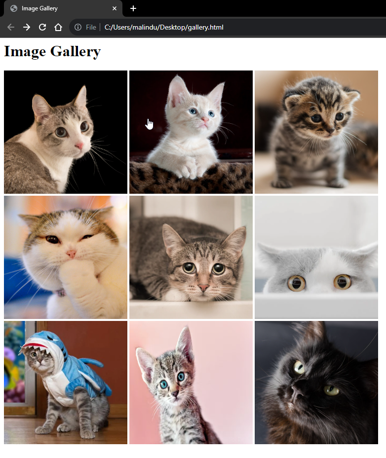

Image එකක් උඩ click කරාම ඒක open වෙන්න ඕනෙ.

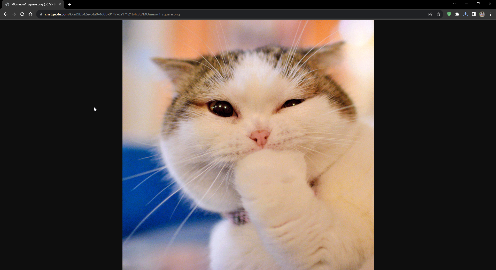

ඉතින් ඔක්කොම හරියට කරා නම් සුපුරුදු පරිදි අපිට screenshots එවන්න [Telegram Group](https://t.me/thisismalindu_chat/1011) එකට. ආයෙත් කියනවා, කරගන්න බැරි උනත් එවන්න, ගැටලු තියනවා නම් කියන්න. අපි විසඳල හරියට මේ වැඩේ සාර්ථක කරගමු.

Homework එක හරියට කරොත් ගෙදර අයට පෙන්නන්න, යාලුවන්ට පෙන්වන්න. අපි එහෙනම් ඊළඟ පාඩමෙන් හම්බෙමු.