# Installing a Code Editor

[Watch the Related Video 👇 ](https://youtu.be/Wic6ZYJU9gk)


## What is a Code Editor 🤔
ඔයා දන්නවා ඇති නේ අපිට ලියුමක් ලියන්න ඕනේ නම් අපි ගොඩක් දුරට [Microsoft Word](https://www.google.com/search?q=ms+word) use කරනවා නේ. අන්න ඒ වගේ code ලියන්න තියන software වලට තමා Code Editors කියන්නේ. ලියුම් ලියද්දි නම් අපිට සමහර දේවල් **bold** කරන්න <u>underline</u> කරන්න වෙනවා, ඒක නිසා අපිට නිකන් [Notepad app](https://en.wikipedia.org/wiki/Windows_Notepad) එකෙන් ලියුමක් ලියන්න අමාරුයි. හැබැයි coding වලදි නම් ඇත්තටම notepad එකෙන් උනත් code ලියන්න පුලුවන්. මේකට හේතුව coding වලදි අපි වචන ලියනවා විතරයි. කිසිම විදිහේ bold හෝ underline කිරීමක් කරන්නෙ නෑ. හැබැයි notepad එකෙන් code ලියන්න අමාරුයි. මේකට හේතුව code ලියද්දි code editor එකක් use කරොත් ඒකෙන් අපිට coding වලටම හදපු features ටිකක් ලැබෙනවා. අපේ code එකේ විශේෂ වචන පාට කරල පෙන්නනවා ([syntax highlighting](https://en.wikipedia.org/wiki/Syntax_highlighting)). අපේ code එක [autocomplete](https://www.google.com/search?q=autocompletion) කරනවා. අපේ code එකේ වැරදි හරි ගස්සනවා. මේ නිසා තමයි අපි අලුතෙන් software එකක් install කරගන්න යන්නෙ, code ලියන්නම කියලා. මේ series එකේ ඉස්සරහට යද්දි ඔයාට තේරෙයි මේ code editors කොච්චර powerful ද කියලා. කෝමහරි අද අපි බලමු කෝමද code editor එක install කරන්නේ කියලා.

## Let's Install VSCode 👨‍💻
VSCode කියන්නේ ලෝකේ තියෙන ගොඩක්ම ජනප්‍රිය code editor එකක්. මේක තම industry එකේ වැඩිපුරම use කරන්නේ. ඉතින් අපිත් ඒක තමා use කරන්නෙ. ඇයි එක use කරන්නෙ කියලා මන් දැන් කියන්න යන්නෙ නෑ. ඔයාට අනගතේදී තේරුන් යයි මේක කොච්චර හොඳද කියන එක.

මේක install කරන්න මුලින්ම මේ [link](https://code.visualstudio.com/) එකට යන්න, නැත්තන් Google කරලත් ගන්න පුලුවන්.

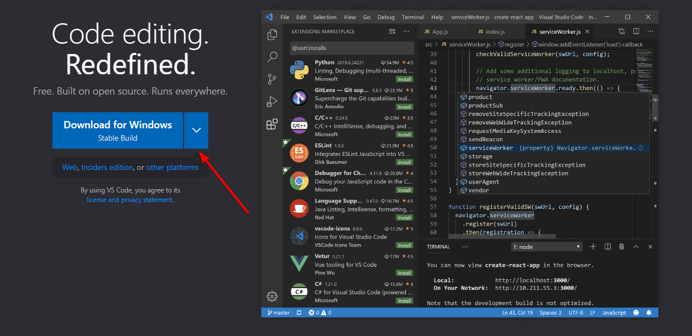

මෙතනින් ඔයාගේ OS (Windows/MacOS/Linux) එක තෝරගෙන Stable Version එක Download කරගන්න.

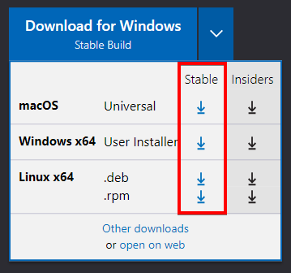

Installer එක Open කරන්න

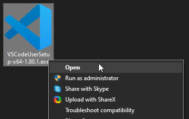

License එක accept කරලා Next ඔබන්න

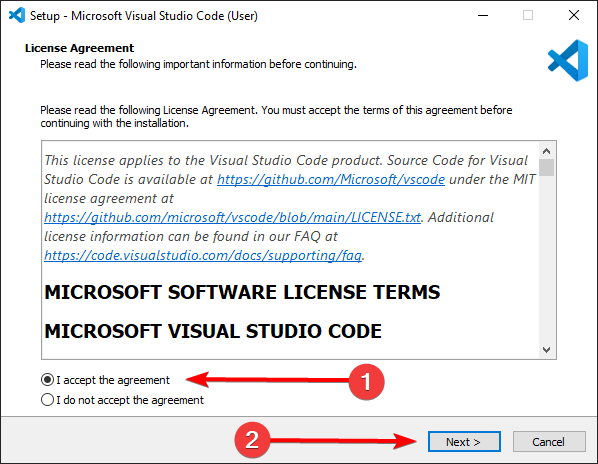

මේ ඔක්කොම check කරලා Next දෙන්න

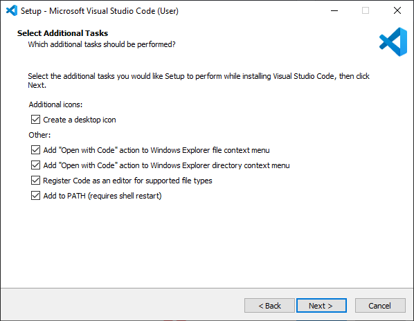

Install දෙන්න

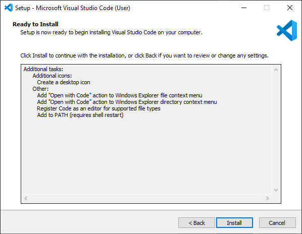

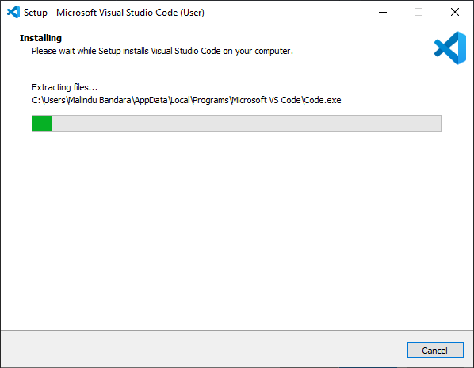

Finish දෙන්න

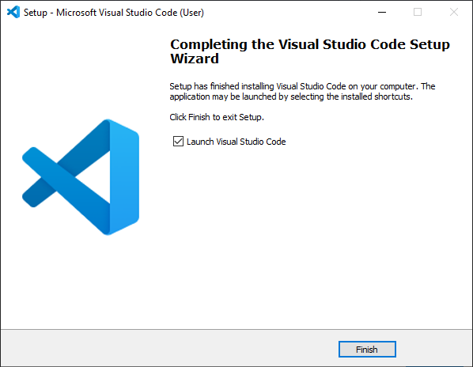

හරි දැන් install කරලා ඉවරයි. දැන් VSCode open වෙයි.

## A journey through VSCode 🚗
ඔයා VSCode open කරාම මේ වගේ ප‌ෙනෙයි.

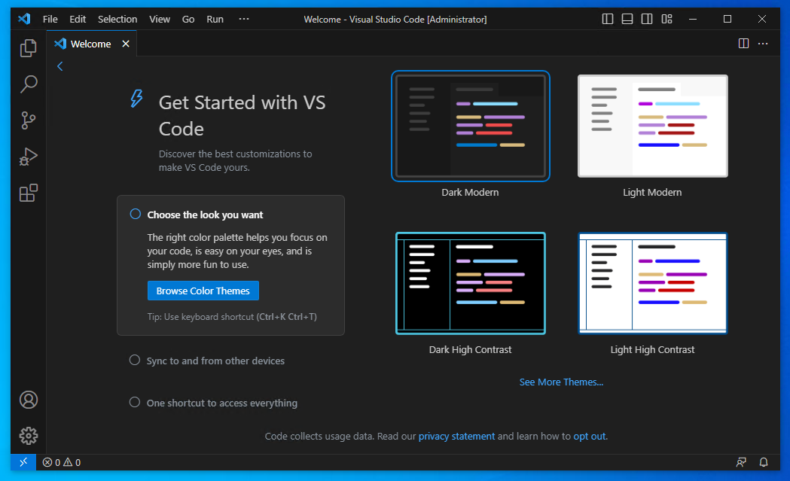

Welcome Page එක close කරන්න.

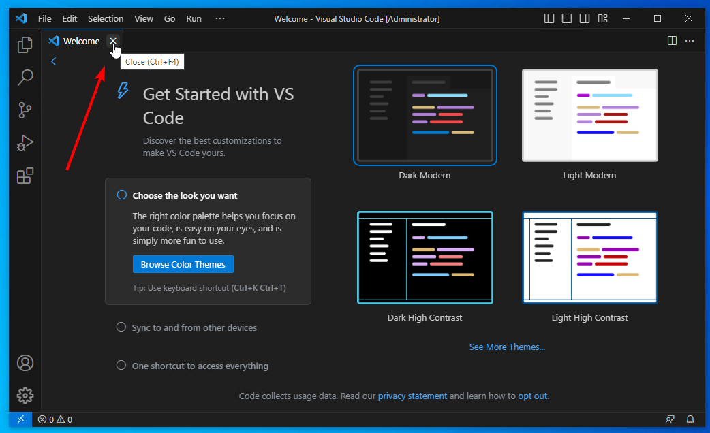

දැන් `Ctrl+N` ඔබන්න. එතකොට අලුත් file එකක් හැදෙනවා. මේ file එකේ අපිට codes ලියන්න පුලුවන්.

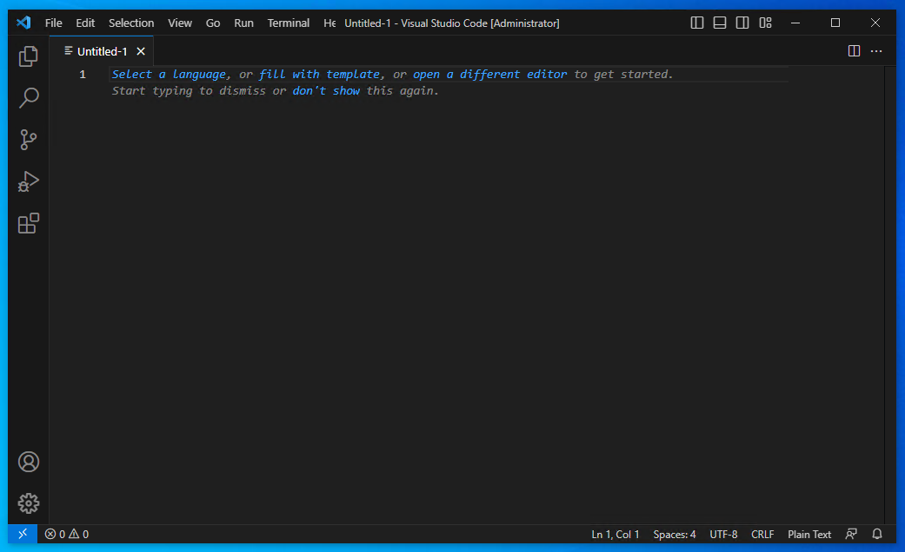

අපි දැනට පොඩි test එකක් විතරක් කරමු. හරියට website හදන හැටි පස්සේ බලමු. හැමදේම හරියට වැඩද බලන්න තමා මේ හදන්නේ.

Select a language කියන එක click කරන්න.


එතකොට එන එකේ `html` කියලා type කරලා `Enter` ඔබන්න.

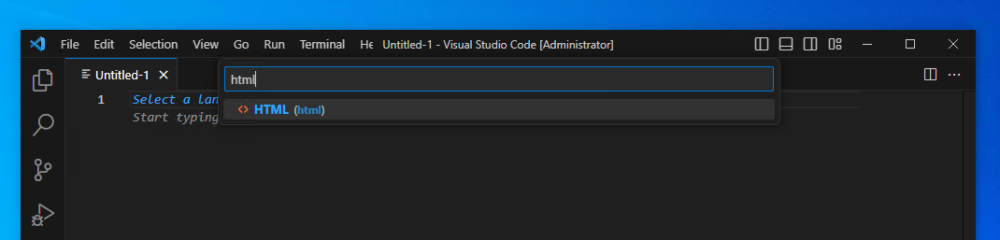

ම‌ෙන්න මේ code එක copy කරලා paste කරන්න 👇

```HTML
<html>
    <head>
        <title>Test Website</title>
    </head>
    <body>
        <h1>
            Hello World
        </h1>
    </body>
</html>
```
`Ctrl+S` ඔබලා save කරන්න.

Desktop එකේ `test.html` වගේ save කරන්න දැනට.

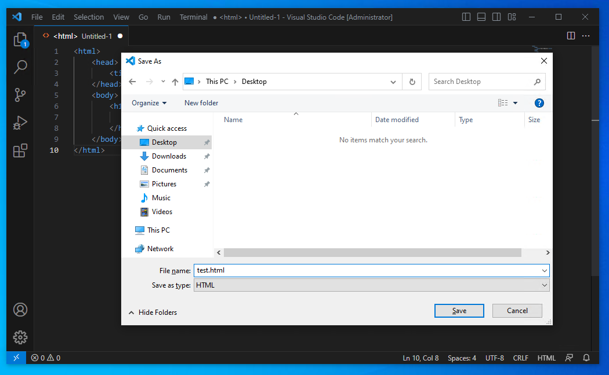

දැන් Desktop එකේ තියෙන ඒ file එක double click කරලා open කරගන්න.

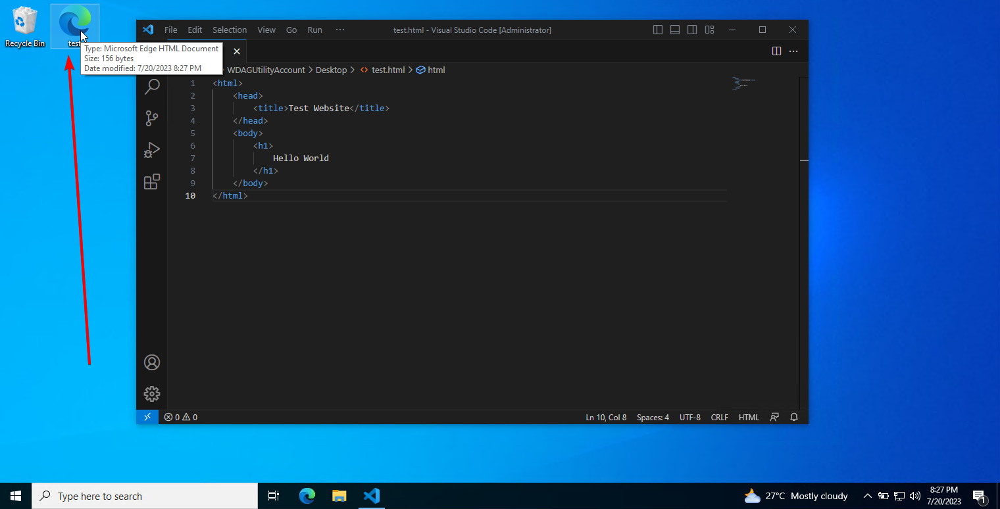

දැන් ම‌ෙහෙම ආවොත් වැඩේ හරි.

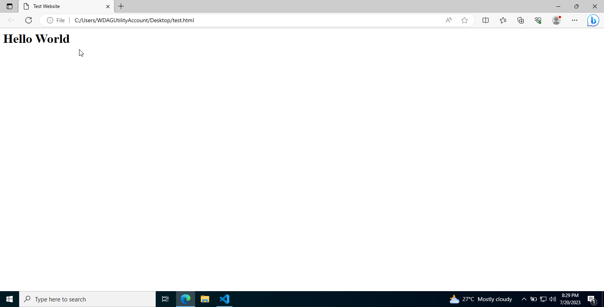

එහෙම ආවේ නැත්තන් [YouTube](https://www.youtube.com/watch?v=As63C442b0I) එකේ comment එකක් හරි [Telegram Group](https://t.me/thisismalindu_chat/1011) එකේ දාන්න Screenshots එක්ක. වැඩේ ගොඩදාගමු කෝමහරි.

## දැන් හරි ✅
දැන් අපි Code Editor එකක් install කරගත්තා. අපි ඉස්සරහට බලමු කොහොමද මේකෙන් හරියටම website හදන්නේ කියලා. Programming හැමදේම තිතට විස්තර කරල දෙන්නම්. අද නම් මොකුත් homework නෑ, ආයේ software එක install කරගන්න තමා වෙන්නේ homework විදිහට 😂. අද කරපු දේවල් ගොඩක්ම සරල දේවල්. Software එකක් install කරගන්න දන්නෙ නැති අය ඉන්න පුලුවන්. ඒ අයටත් එක්ක තමා අද පාඩම කරේ. ඉතින් මේ වගේ දේවල් මන් ආයේ කියලා දෙන්නෙ නෑ. මේ දේවල් developer කෙනෙක් හැටියට පුලුවන් වෙන්න ඕනේ. පොඩ්ඩක් computer එක එහෙම use කරලා මේ වගේ දේවල් පුරුදු වෙන්න. එතකොට මේ ගමන යන එක ගොඩක් ලේසී.

ඊලඟ පාඩමෙන් හම්බෙමු.